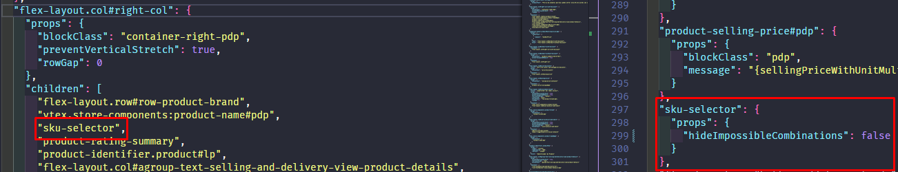
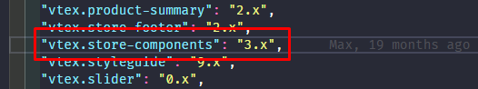

# Spike - LIONS 257

### PDP | Estudo de viabilidade técnica p/ variante de SKU nativo

**1. Introdução**

Foi solicitado que fosse incluído na página de produto (PDP) as opções de variantes de SKUs do produto principal que é exibido na página de produto, de acordo com a funcionalidade nativa VTEX.

**2. Solução**

Para essa análise nos adicionamos o componente nativo da VTEX ao arquivo que define quais blocos serão renderizados na PDP e a Workspace que estamos utilizando é a [SKU](https://sku--obahortifruti.myvtex.com/leite-piracanjuba-1-l/p)

O componente nativo da VTEX foi incorporado conforme as diretrizes estabelecidas em sua documentação:
[SKU Selector - VTEX Developers](https://developers.vtex.com/docs/apps/vtex.store-components/SKUSelector)

Para que o sku-selector funcione corretamente, é necessário incluir ao manifest.json o [vtex.store-components](https://developers.vtex.com/docs/guides/store-components). No entanto, é importante mencionar que esta chamada já está presente no documento e está sendo utilizado na loja atualmente:

**3. Diretrizes para o Desenvolvimento**

Mesmo após a implementação desses ajustes, as informações das variações de SKU ainda não estão sendo renderizadas corretamente na nossa PDP. Diante disso, abrimos um ticket junto à VTEX (#945797) para análise e feedback. Contudo, considerando a personalização necessária para atender ao nosso modelo de negócios, a recomendação é criar um componente personalizado para a seleção de SKU. Isso nos permitirá adaptar o produto de acordo com as particularidades do nosso cenário, como no caso dos produtos "Oba Bem Querer", cujo nome não pode ser alterado para se adequar ao padrão sugerido pela VTEX.

**:memo: Links úteis:**

[LIONS-257](https://redeoba.atlassian.net/browse/LIONS-257)
